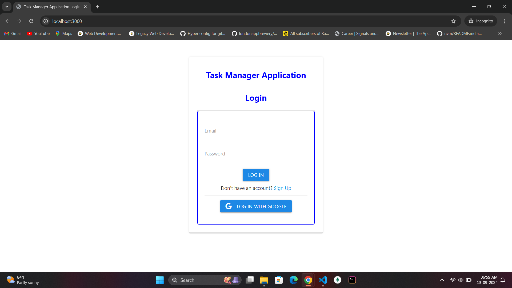
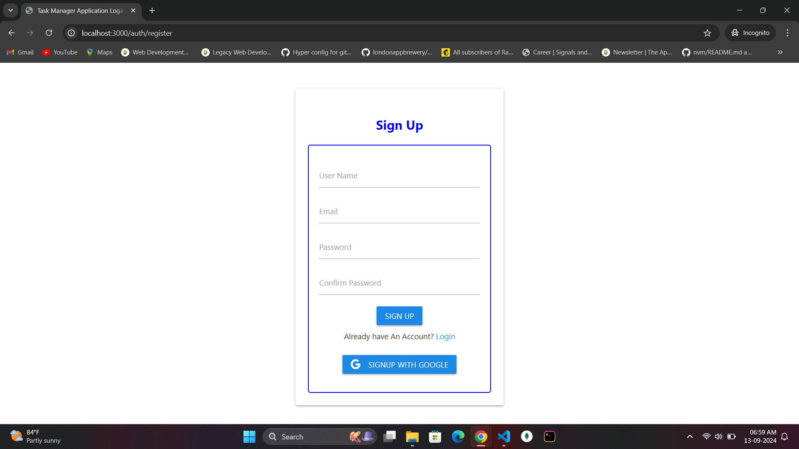
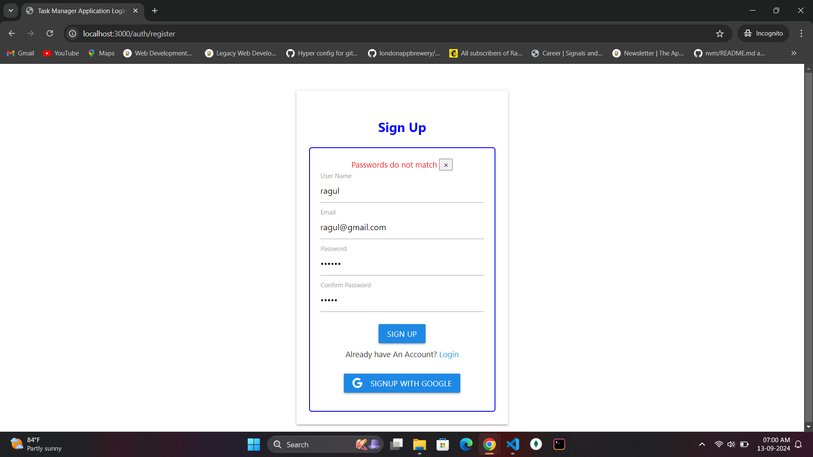
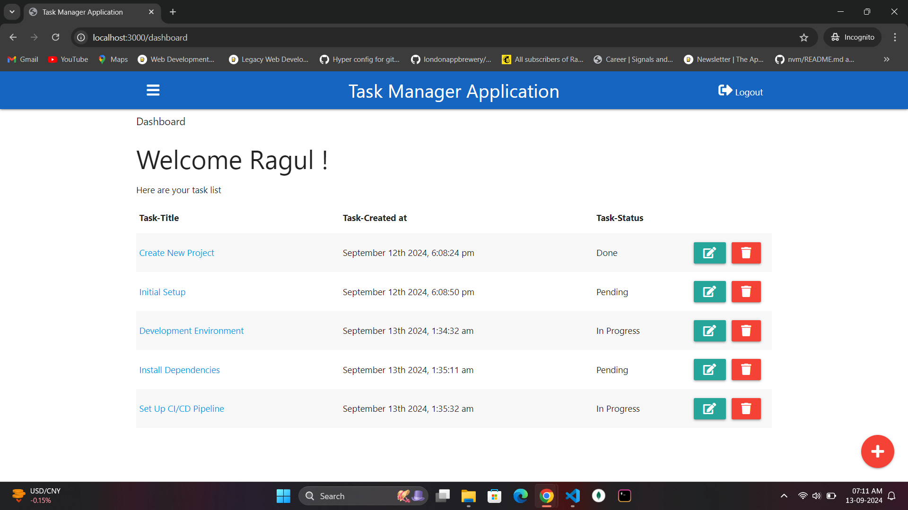
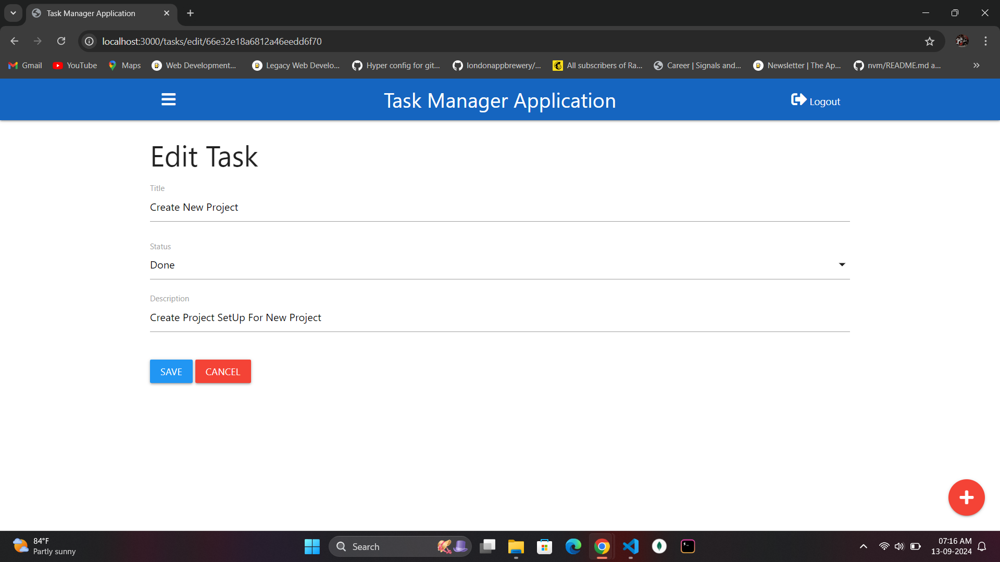
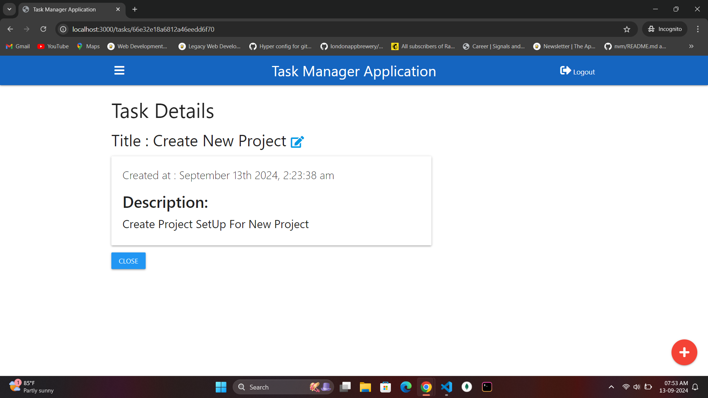
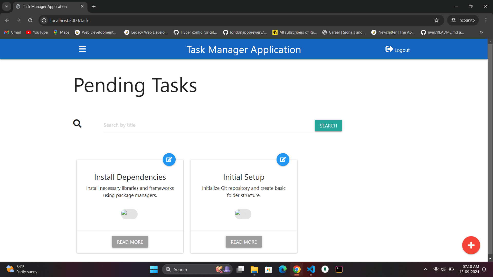

# Task Manager Application

This is a simple task management application where users can manage tasks. Users can sign up, log in via email or Google, and perform CRUD operations on tasks. They now have the ability to search for and view pending tasks. Additionally, users can manage their tasks by categories such as InProgress, Done, and Pending.

## Tech Stack
### Backend:
- **Node.js**
- **Express.js**
- **MongoDB** (Cloud database using MongoDB Atlas)
- **Google OAuth for authentication**
- **Render** (Free hosting platform)

### Frontend:
- **Handlebars** (Template engine)

## Features
- **Google OAuth Login:** Users can log in using their Google account or register manually.
- **CRUD Operations:** Users can create, read, update, and delete tasks.
- **Task Status:** Tasks can have the status of `In Progress`, `Pending`, or `Done`.
- **User Search:** View and search tasks assigned to users.
- **Responsive Design:** Frontend is designed according to mockup specifications.

## Project Setup and Running

### Steps to run the project:
1. Clone the repository:
    ```bash
    git clone https://github.com/Ragul-p/Task-Manager-Application.git
    ```
2. Install dependencies:
    ```bash
    npm install
    ```
3. Create an `.env` file in the root directory and set your environment variables:
    ```bash
    PORT=YOUR_PORT
    MONGO_URI=YOUR_MONGO_ATLAS_URI
    GOOGLE_CLIENT_ID=YOUR_GOOGLE_CLIENT_ID
    GOOGLE_CLIENT_SECRET=YOUR_GOOGLE_CLIENT_SECRET
    ```
4. Run the application:
    ```bash
    npm run dev
    ```

### Hosting and Deployment
The app is hosted on [Render](https://render.com/), and MongoDB Atlas is used as the cloud database for storing user and task data.

## Project Flow
1. **User Authentication:** 
   - Users can either register using the sign-up form or log in using their Google account.
   - Upon successful authentication, users are redirected to the dashboard.

2. **Dashboard:** 
   - Users are welcomed to the dashboard where they can create tasks.
   - Tasks are categorized as `Pending`, `In Progress`, or `Done`.


3. **Task Management:**
   - Users can create new tasks with a title and assign them to a status.
   - Tasks can be edited, deleted, or moved between different columns.

4. **Search Feature:**
   - Users can search for pending tasks and filter them.

## Screenshots
Here are a few screenshots to demonstrate the UI and flow of the application:

### 1. **Login**


### 2. **Login Error Page**


### 3. **SignUp**


### 4. **SignUp  Error Page**


### 5. **Dashboard**


### 6. **Add Task**


### 7. **Edit Task**


### 7. **Task Detail**


### 8. **Pending Task - Search**


## Thank you

Thank you for reviewing this Task Manager Application. If you have any questions or need further information, please feel free to reach out.
